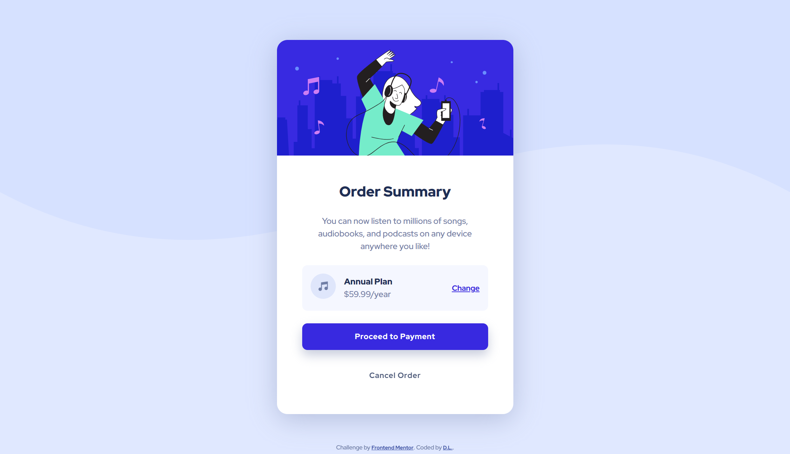

# Frontend Mentor - Order summary card solution

This is a solution to the [Order summary card challenge on Frontend Mentor](https://www.frontendmentor.io/challenges/order-summary-component-QlPmajDUj). Frontend Mentor challenges help you improve your coding skills by building realistic projects. 

## Table of contents

- [Overview](#overview)
  - [The challenge](#the-challenge)
  - [Screenshot](#screenshot)
  - [Links](#links)
- [My process](#my-process)
  - [Built with](#built-with)
  - [What I learned](#what-i-learned)
  - [Continued development](#continued-development)
  - [Useful resources](#useful-resources)
- [Author](#author)

## Overview

### The challenge

Users should be able to:

- View the page on mobile and desktop
- See hover states for interactive elements

### Screenshot

### Links

- Solution URL: [Github Repo](https://github.com/dllddlld/fm-order-summary)
- Live Site URL: [Github Pages](https://dllddlld.github.io/fm-order-summary/)

## My process

### Built with

- HTML5
- CSS
- Flexbox

### What I learned

- How to use @media to display different properties based on screen size

### Continued development

- Responsive design

### Useful resources

- [How to make a mobile-friendly website](https://www.thesitewizard.com/css/mobile-friendly-responsive-design.shtml)

## Author

- Website - [dllddlld](https://github.com/dllddlld/)
- Frontend Mentor - [@dllddlld](https://www.frontendmentor.io/profile/dllddlld)
